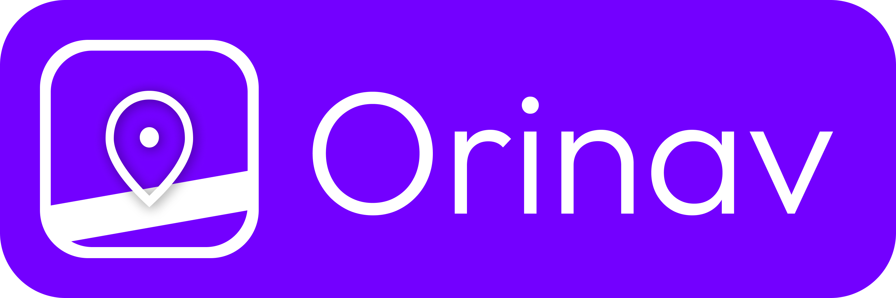

Welcome to Orinav!

Orinav is a new navigation app for people with visual impairments, produced through the research project "A Hybrid Mobile Outdoor Navigation Application for People with  Visual Impairments." Orinav seeks to integrate macro-navigation (route planning) and micro-navigation (environment awareness) in one cohesive experience to reduce friction when navigating.

* Navigate: Orinav provides step-by-step route guidance tailored with accessibility enhancements, including more frequent announcements, real-time direction guidance, and instant instruction replay by shaking your phone.
* Explore: Orinav implements machine learning-powered computer vision to detect obstacles, traffic lights, and tactile pavings, supporting real-time decision-making for safe movement.

This is Orinav's website.

## 📝 Installation

Users can install Orinav on the iOS App Store.

## 🤝 Feedback and Contributions

Please feel free to contribute by submitting an issue. Each contribution helps us grow and improve. We appreciate your support and look forward to making Orinav even better with your help!

## 📃 License

This product is distributed under a proprietary license. Please refer to [Orinav Terms of Service](https://orinav.com/terms) for details.
